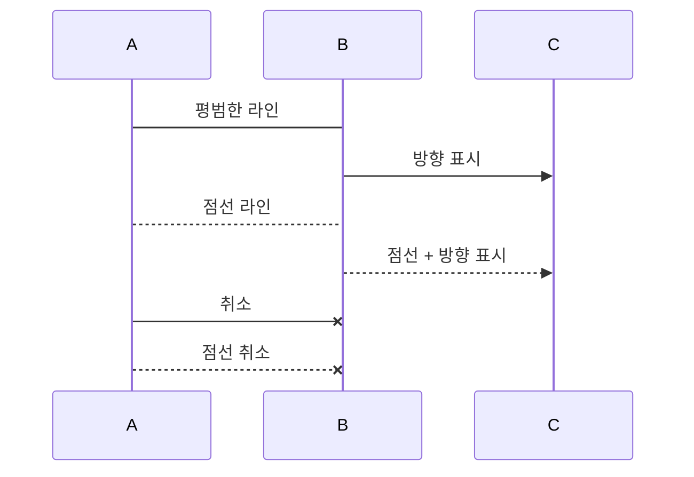
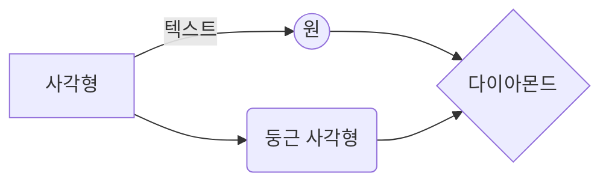

# 마크다운 문법 정리
## 1. 헤더
* 큰제목 : 문서제목
```
this is an h1
=========
```
this is an header1
=========
* 작은 제목 : 문서 부제목
```
this is an h2
--------------
```
this is an header2
--------------
* 글머리 : 1~6까지만 지원
```
# this is a header1
## this is a header2
### this is a header3
#### this is a header4
##### this is a header5
###### this is a header6
```

# this is a header1
## this is a header2
### this is a header3
#### this is a header4
##### this is a header5
###### this is a header6
####### this is a header7(지원하지 않음)

## 2. blockquote
이메일에서 사용하는 `>` 블럭인용문자를 이용한다.
```
>this is a first blockquote
>> this is a second blockquote
>>> this is a third blockquote
```
> this is a first blockquote
>> this is a second blockquote
>>> this is a third blockquote

이 안에서는 다른 마크 다운 요소를 포함할 수 있다.

> this is a h3
> * List
> ``` 
> code 
> ```

## 3. 목록
### ● 순서있는 목록(번호)
순서있는 목록은 숫자와 점을 사용한다.
```
1. 첫번째
2. 두번째
3. 세번째
```
1. 첫번째
2. 두번째
3. 세번째

### ● 순서없는 목록(글머리 기호: `*`, `+`, `-` 지원)
```
* 빨강
  * 녹색
    * 파랑

+ 빨강
  + 녹색
    + 파랑

- 빨강
  - 녹색
    - 파랑
```

* 빨강
	* 녹색
		* 파랑

+ 빨강
	+ 녹색
		+ 파랑

- 빨강
	- 녹색
		- 파랑

혼합해서 사용하는 것도 가능하다.

## 4. 코드
4개의 공백 또는 하나의 탭으로 들여쓰기를 만나면 변환되기 시작하여 들여쓰지 않은 행을 만날 때까지 변환이 계속된다.

### 4.1. 들여쓰기
```
this is a normal paragraph:

	this is a code block.
	
end code block.
```
실제로 적용해보면, 
적용 예: 

this is a normal paragraph:

	this is a code block.    
end code block.

> 한 줄 띄어쓰지 않으면 인식이 제대로 안되는 문제가 발생합니다.

### 4.2. 코드블럭

* 깃헙에서는 코드블럭 코드("```") 시작점에 사용하는 언어를 선언하여 문법강조(Syntax highlighting)이 가능하다.
<pre><code>
```java
public class BootSpringBootApplication {
  public static void main(String[] args) {
    System.out.println("Hello, Honeymon");
  }
}
```</code>
</pre>
적용
```java
public class BootSpringBootApplication {
  public static void main(String[] args) {
    System.out.println("Hello, Honeymon");
  }

}
```

* sequence diagram
<pre>
<code>```mermaid
sequenceDiagram
A->B : 평범한 라인
B->> C : 방향 표시
A-->B : 점선 라인
B-->>C : 점선 + 방향 표시
A-xB: 취소
A--xB: 점선 취소
```</code>
</pre>
적용

* graph
<pre>
<code>```mermaid
graph LR
A[사각형] -- 텍스트 --> B((원))
A --> C(둥근 사각형)
B --> D{다이아몬드}
C --> D
```</code>
</pre>
적용


## 5. 수평선 `<hr/>`
아래 줄은 모두 수평선을 만든다. 마크다운 문서를 미리보기로 출력할 때 페이지 나누기 용도로 많이 사용한다.
```
* * *

***

*****

- - -

---------------------------------------
```

* * *
***

******
- - -
-----------------------------------------

## 6. 링크
* 참조링크

```
[link keyword][id]
[id]: URL "Optional Title here"

//code
Link : [Google][googlelink]

[googlelink]: https://google.com "Go google"
```

Link : [Google][googlelink]

[googlelink]: https://google.com "Go google"

* 외부 링크
```
사용 문법 [title](link)
적용예: [google](https://google.com, "google link")
```
Link: [Google](https://google.com, "google link")

* 자동 연결
```
일반적인 URL 혹은 이메일 주소인 경우 적절한 형식으로 링크를 형성한다.
* 외부링크 : <http://example.com/>
* 이메일링크: <address@example.com>
```

* 외부링크 : <http://example.com/>
* 이메일링크: <address@example.com>

## 7. 강조
```
*single asterisks*
_single underscores_
**double asterisks**
__double underscores__
~~cancelline~~
```
* normal
* *single asterisks*
* _single underscores_
* **double asterisks**
* __double underscores__
* ~~cancelline~~


## 8. 이미지
```


```


사이즈 조절 기능은 없기 때문에 ```</img>```를 이용한다.

예
```
</img><br/>
</img>
```
</img><br/>
</img>


## 9. 표

```
|제목|내용|설명|
|:---|---: |:---:|
|일반|오른쪽정렬|중앙정렬|
|일반|**오른쪽 정렬**|중앙정렬|
|일반|<span style="color:red">오른쪽 정렬</span>|중앙정렬|
```

|제목|내용|설명|
|:---|---: |:---:|
|일반|오른쪽정렬|중앙정렬|
|일반|**오른쪽 정렬**|중앙정렬|
|일반|<span style="color:red">오른쪽 정렬</span>|중앙정렬|

## 10. 체크 박스
```
* [ ] 운동하기
* [x] 강의 듣기
```
* [ ] 운동하기
* [x] 강의 듣기


#### 참고 사이트

* [마크다운 사용법](https://gist.github.com/ihoneymon/652be052a0727ad59601)
* [stackedit welcome.md](https://stackedit.io/)